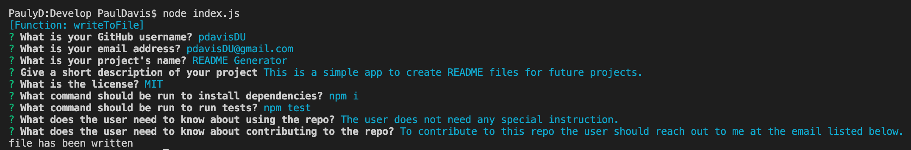

# README Generator
  
  ## Table of Contents
  - [Description](#description)
  - [Installation](#command)
  - [Usage](#repo)
  - [Contributing](#contribute)
  - [Tests](#tests)

  ## Description
  This is a simple app to create README files for future projects.  
  
    

  

  ## Installation
  To install run npm i
  ## Usage
  The usage info is: The user does not need any special instruction.
  ## Contributing
  To contribute to this project To contribute to this repo the user should reach out to me at the email listed below.
  ## Tests
  To run tests npm test
  ## Questions
  For any questions please contact me at  
  Github: [pdavisDU](https://github.com/pdavisDU)  
  Email: pdavisDU@gmail.com

